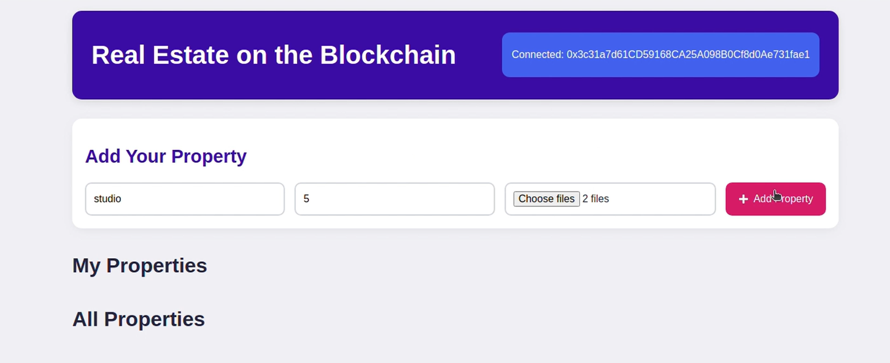
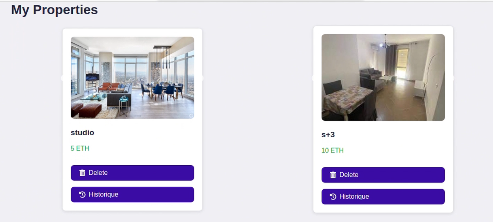
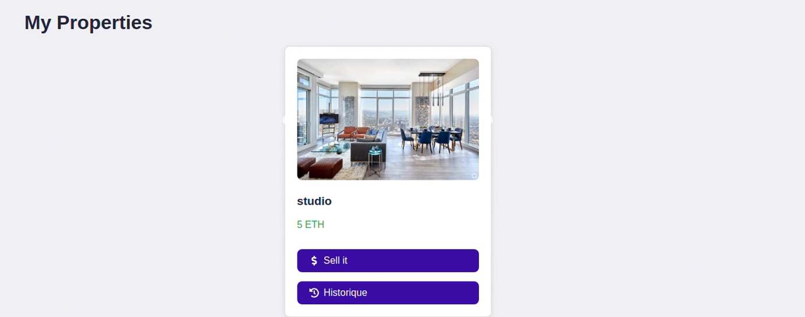
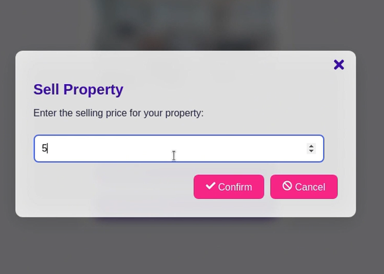
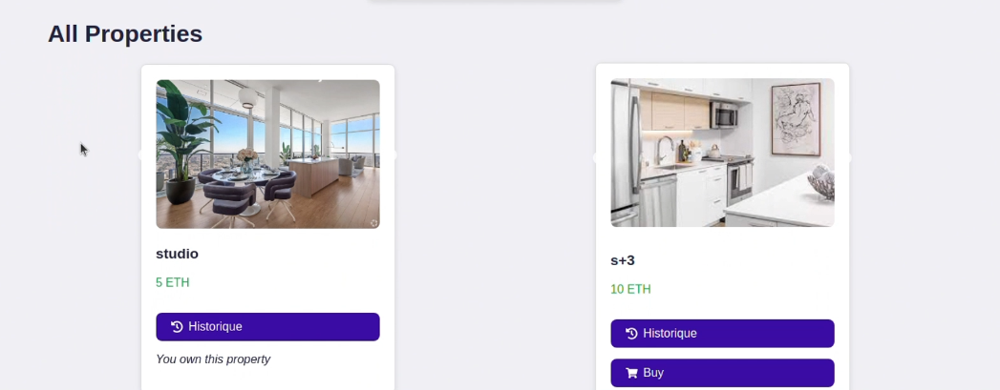
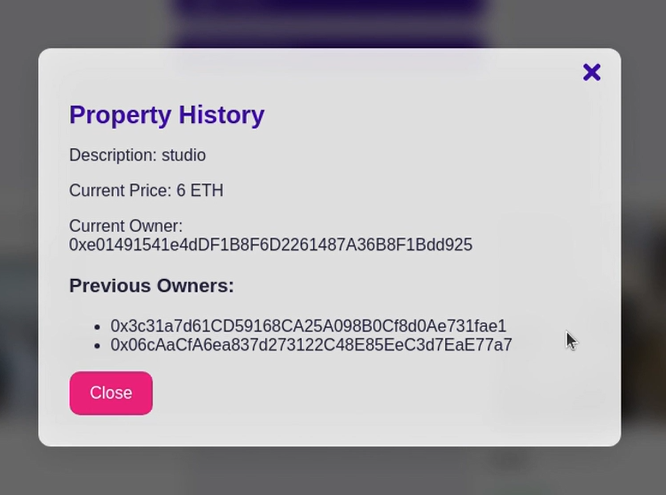

# 🏡 Projet de Vente Immobilière sur Blockchain

## 🌐 Introduction

Dans un monde où l'immobilier est souvent synonyme de complexité, de coûts élevés et de lenteur, notre projet vise à transformer radicalement ce secteur grâce à la technologie Blockchain. En développant une application de vente immobilière, nous simplifions et sécurisons les transactions, rendant le processus d'achat et de vente plus fluide et transparent.

### 🎯 Objectif du Projet

Notre objectif est de créer une plateforme innovante qui facilitera la vente de biens immobiliers, avec les points suivants :

- **Simplifier les transactions** : Réduire la complexité des processus d'achat et de vente.
- **Accélérer le temps de traitement** : Minimiser les délais grâce à l'automatisation des étapes avec des smart contracts.
- **Renforcer la sécurité des données** : Assurer la protection des informations sensibles des utilisateurs.
- **Réduire le besoin d'intermédiaires** : Limiter le nombre d'acteurs impliqués dans la transaction pour diminuer les coûts.
- **Offrir des options de paiement en cryptomonnaies** : Élargir les possibilités de paiement pour les utilisateurs.
- **Assurer une traçabilité complète des transactions** : Permettre un suivi transparent de l'historique des transactions.

En fin de compte, nous souhaitons rendre le marché immobilier plus accessible et efficace, tout en garantissant une transparence totale dans les transactions.

## 💻 Installation

### Installation de Ganache

Pour installer Ganache, vous avez deux options :

1. **Interface graphique** :
   - Téléchargez l'interface graphique depuis le site officiel de Truffle.

2. **Version CLI** :
   - Installez la version CLI via npm :
     ```bash
     npm install -g ganache
     ```

3. **Téléchargement direct** :
   - Vous pouvez également télécharger Ganache à partir de [ce site](https://archive.trufflesuite.com/ganache/).

### Configuration de MetaMask

1. Installez l'extension MetaMask dans votre navigateur. Vous pouvez l'ajouter à Google Chrome via le Chrome Web Store.
2. Créez un nouveau portefeuille ou importez-en un existant.
3. Configurez les comptes MetaMask avec les clés privées des comptes Ganache.

### Installation de Node.js, React.js et MongoDB

1. **Installer Node.js** :
   - Téléchargez et installez Node.js à partir du [site officiel](https://nodejs.org/).

2. **Installer MongoDB** :
   - Suivez les instructions sur le [site de MongoDB](https://www.mongodb.com/try/download/community) pour installer la version Community de MongoDB.

3. **Installer React.js** :
   - Dans votre terminal, exécutez :
     ```bash
     npx create-react-app nom-du-projet
     ```

## 🚀 Démarrage du Projet

Pour lancer le projet, suivez ces étapes :

1. **Ouvrir Ganache** :
   - Lancez Ganache pour créer un environnement de développement local pour vos transactions Blockchain.

2. **Ouvrir MongoDB** :
   - Démarrez le serveur MongoDB pour gérer la base de données de votre application. Utilisez la commande suivante dans votre terminal :
     ```bash
     mongod
     ```

3. **Backend** :
   - Naviguez dans le répertoire du backend et démarrez le serveur :
     ```bash
     node server.js
     ```

4. **Frontend** :
   - Naviguez dans le répertoire du frontend et démarrez l'application React :
     ```bash
     npm start
     ```


## 🛠️ Utilisation

Pour utiliser l'application, suivez ces étapes :

1. Ouvrez votre navigateur et accédez à `http://localhost:3000`.
2. Créez un compte ou connectez-vous si vous en avez déjà un.
3. Naviguez dans la plateforme pour explorer les biens immobiliers disponibles.
4. Effectuez des transactions en utilisant les options de paiement disponibles.

## 🛠️ Technologies Utilisées

- **Blockchain** : Pour assurer la sécurité et la transparence des transactions.
- **Node.js** : Pour le développement du backend.
- **React** : Pour l'interface utilisateur.
- **Smart Contracts** : Pour automatiser les transactions.
- **MongoDB** : Pour la gestion de la base de données.

## 📋 Présentation du Projet

Ce projet innovant utilise la technologie Blockchain pour simplifier et sécuriser le processus de vente de biens immobiliers. Voici un aperçu des principales fonctionnalités de l'application.

### 1. Ajouter un Bien (Add Property)

Cette fonctionnalité permet aux utilisateurs d'ajouter de nouveaux biens immobiliers à la plateforme. L'interface est conçue pour être intuitive et facile à utiliser.



### 2. Mes Propriétés (My Properties)

Dans cette section, les utilisateurs peuvent consulter leurs propriétés enregistrées. Ils peuvent également choisir de vendre un bien en cliquant sur le bouton "Sell It", qui ouvre une interface dédiée.




#### Interface de Vente (Sell It)

Lorsqu'un utilisateur clique sur "Sell It", une nouvelle interface s'ouvre pour gérer la vente du bien.



### 3. Toutes les Propriétés (All Properties)

Les utilisateurs peuvent explorer toutes les propriétés disponibles sur la plateforme. Chaque propriété peut être achetée en cliquant sur le bouton "Buy".



### Historique des Transactions

Les utilisateurs peuvent accéder à leur historique de transactions en cliquant sur le bouton "Historique". Cela ouvre une interface dédiée où ils peuvent consulter toutes leurs transactions passées.



## 🏁 Conclusion

Cette application de vente immobilière sur Blockchain vise à révolutionner le marché immobilier en rendant les transactions plus simples, plus rapides et plus sécurisées. Nous espérons que notre plateforme apportera une véritable valeur ajoutée aux utilisateurs, tout en leur offrant une expérience utilisateur exceptionnelle. Ensemble, construisons un avenir immobilier transparent et accessible pour tous ! 🌟
